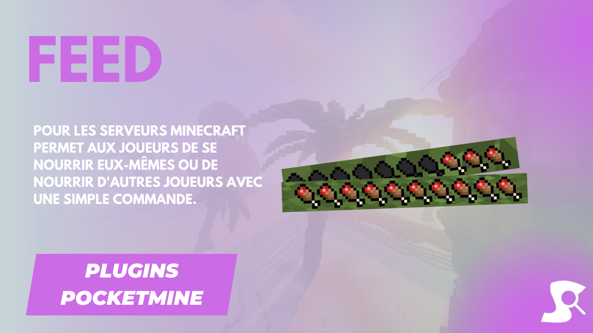

# [Feed](https://github.com/Synopsie/Feed) Plugin 🍲


## Features 🛠️

- **Command**: Use `/feed` to feed yourself or others.
- **Configurable**: Various customization options.
- **Permissions**: Control command access.
- **Cooldown**: Optional cooldown for feeding.
- **Messages**: Inform players of actions.

## Configuration 📝

```yaml
#Configuration pour le plugin feed.

#plugin
load-plugin-message: true
load-plugin-message-text: '§aLe plugin FeedCommand a été chargé.'
enable-plugin-message: true
enable-plugin-message-text: '§aLe plugin FeedCommand a été activé.'
unload-plugin-message: true
unload-plugin-message-text: '§cLe plugin FeedCommand a été déchargé.'

#commande
name: feed
description: Nourrissez-vous
usage: /feed [joueur]
aliases:
  - eat
#Op: op
#Console: console
#Joueurs: user
permission: feed.command
default: user
permission-feed-others: feed.command.others
default-feed-others: op

#personnalisé
# -1 = pas de cooldown
cooldown: -1
cooldown-in-console: false
console-can-feed-other: true
#Si le paramètre est vrai,
#alors le pseudo mis pour nourrir une autre personne doit être exactement le même que celui de la personne, sinon cela ne fonctionne pas.
must-pseudo-exact: false
food-restored: 20
saturation-restored: 20

#messages
console-cannot-feed-other-message: "§cVous ne pouvez pas nourrir d'autres joueurs depuis la console."
player-not-found-message: '§cJoueur non trouvé.'
feed-message: '§aVous avez été nourri.'
feed-other-message: '§aVous avez nourri %player%.'
feed-by-other-message: '§aVous avez été nourri par %player%.'
cooldown-message: '§cVous devez attendre %time% secondes avant de vous nourrir à nouveau.'
```

## License 📜

Licensed under MIT. See [LICENSE](LICENSE) for details.

---

